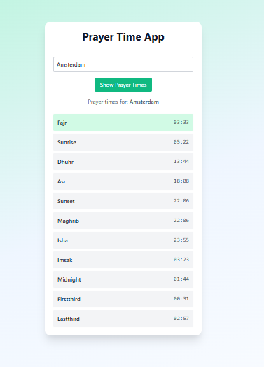

#  Prayer Time App

A simple React app to check Islamic prayer times by city, only works on most common cities located in The Netherlands.

## Screenshot
 


## What I learned

- How to fetch data from a public API (AlAdhan)
- Handling user input and validation in React
- Adding visual feedback like loaders and error messages
- Creating clean UI using Tailwind CSS
- Deploying a React app with Vercel

##  Features

- Get prayer times using the AlAdhan API
- Styled with TailwindCSS
- Validates Dutch cities (temporary whitelist)
- Error handling for empty/invalid input

## Possible Improvements

- Use a global city validation API instead of hardcoded list
- Allow users to select country
- Add Islamic date and Hijri calendar support
- Save last searched city in local storage
- Support for dark mode
- Makes users don't have to scroll / change lay-out.


##  Live Demo

 [Click here to try it live](https://prayer-time-app-ccyb.vercel.app/)

##  Tech used

- React
- TailwindCSS
- AlAdhan API

## How to run locally

```bash
git clone https://github.com/N-amer/Prayer-Time-App.git
cd Prayer-Time-App
npm install
npm start
